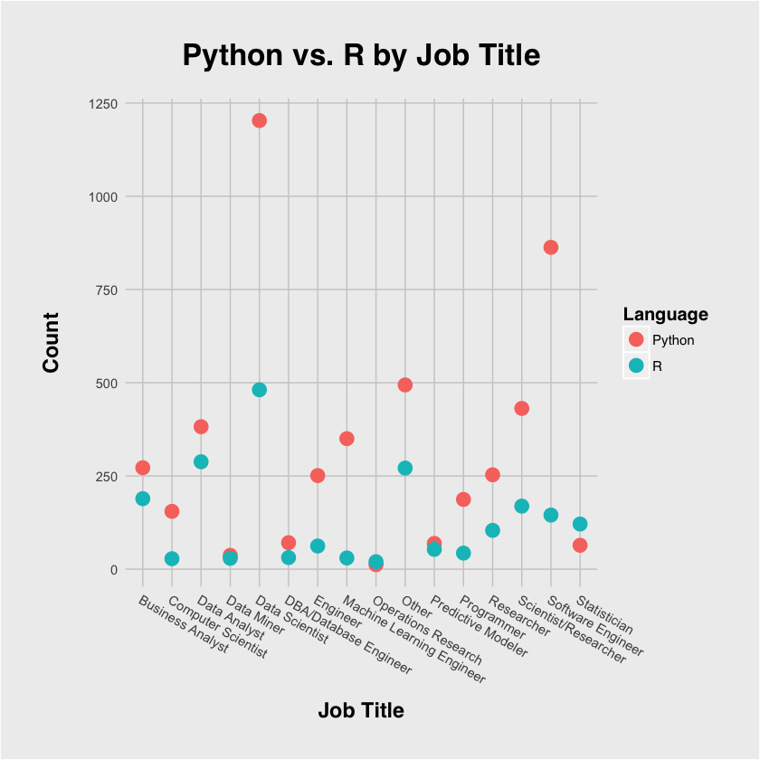
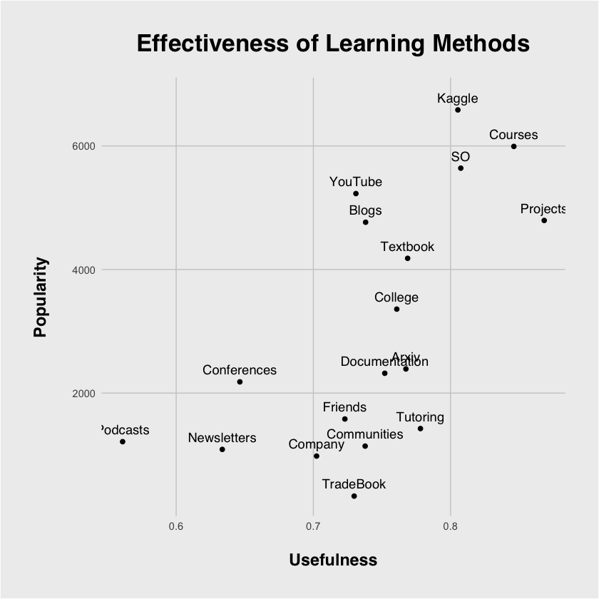
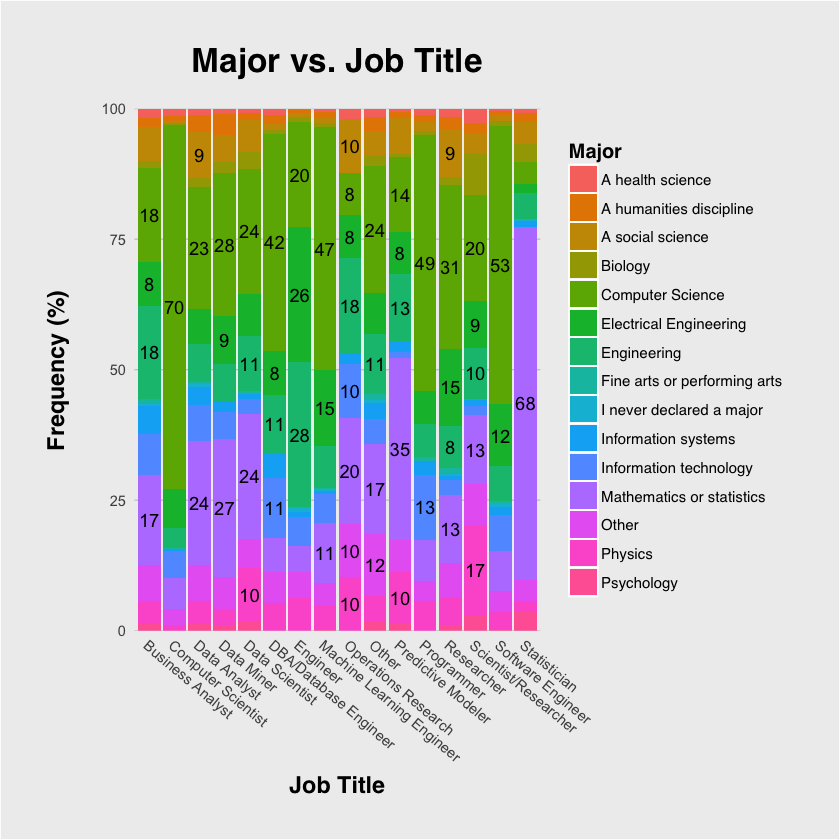
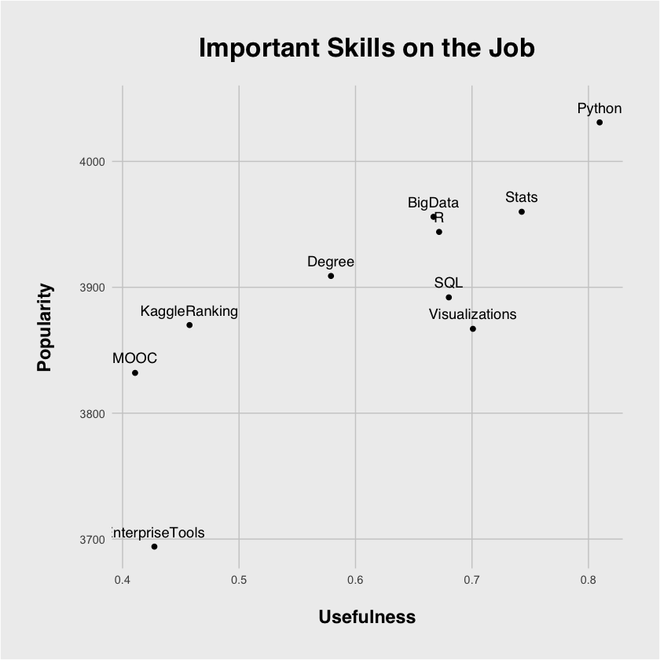

# Kaggle Survey Analysis

I have a growing interest in data science, so I decided to analyze the results of Kaggle's [data science survey](https://www.kaggle.com/kaggle/kaggle-survey-2017) and write about my results in a [kernel](https://kaggle.com/kernels) about how I can become a better data scientist myself. You can read the whole thing [here](https://www.kaggle.com/jackcook/how-to-become-a-data-scientist), but here are the main findings I found:

1. **Learn Python.** Both Python and R have been around for decades, but as we can see in [the first graph](https://www.kaggle.io/svf/1726298/13ce0de91d9dc2c5337553485065a652/__results___files/__results___7_1.png), Python won out in basically every scenario. This is also backed up by [the fourth graph](https://www.kaggle.io/svf/1726298/13ce0de91d9dc2c5337553485065a652/__results___files/__results___13_1.png), in which participants overwhelmingly said that Python was the most important skill on the job. I honestly believe you will be hard-pressed to find a company that doesn't use Python at all, so you should be good to go.
2. **Major in CS and Math.** As I mentioned just after creating the [graph of majors vs. job titles](https://www.kaggle.io/svf/1726298/13ce0de91d9dc2c5337553485065a652/__results___files/__results___9_1.png), every major has some presence in every role. However, judging from the proportions visible on the bar graph, CS majors and math majors are the most abundant in almost every role. Although it's not a requirement, either or both these majors may give you a bit of an edge.
3. **Make projects, take courses, and participate in Kaggle challenges.** As we could see in the [graph analyzing the best resources for learning](https://www.kaggle.io/svf/1726298/13ce0de91d9dc2c5337553485065a652/__results___files/__results___11_1.png), there were a couple of very clear winners. Creating projects, taking online courses, and participating in Kaggle challenges all took the cake as the three most useful resources for learning about data science.
4. **Learn about the most widely used tools.** There seems to be a never-ending supply of data science tools and libraries, but this survey allowed us to see the ones that were considered the most important. The most recommended tools were Python, SQL, R, Jupyter, and Unix, and the most recommended methods to learn were data visualization, cross validation, logistic regression, decision trees, and random forests.

If you want to see how I reached these conclusions, feel free to read the entire writeup, [available on Kaggle](https://www.kaggle.com/jackcook/how-to-become-a-data-scientist).

## Graphs

Here are the graphs I made for this analysis. Personally, I like how these came out, and I believe there are many insights that can be drawn from all of them.

|Getting Started|What to Learn About|
|:-:|:-:|
|||
|||

## License

`kaggle-survey` is available under the MIT license. See the [LICENSE](https://github.com/jackcook/kaggle-survey/blob/master/LICENSE) file for details.
